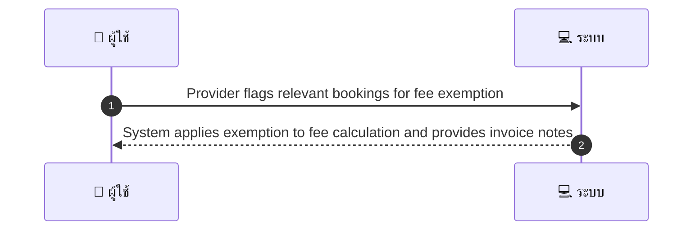
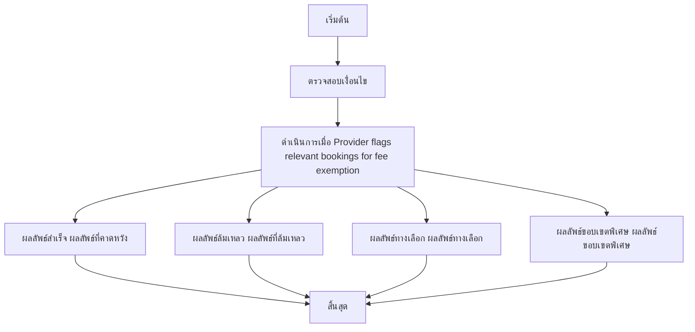

# MCC078 - ตั้งค่าการยกเว้นค่าธรรมเนียมบางรายการสำหรับลูกค้าองค์กร

## 👤 บทบาท
- ผู้ให้บริการ

## 🎯 เป้าหมายของเคส
- ในฐานะ ผู้ให้บริการ
- ต้องการ ร้องขอ exemption/adjustment fees สำหรับลูกค้าองค์กรที่มีสัญญา
- เพื่อ เพื่อรองรับ B2B agreements

## ⚙️ เงื่อนไขก่อนเริ่ม (Precondition)
- Provider has agreement with client

## 🧭 ผลลัพธ์และสถานการณ์
- ✅ ผลลัพธ์ที่คาดหวัง (Success Flow): System applies exemption to fee calc and provides invoice notes
- ❌ ผลลัพธ์ที่ Failure:
  - ไม่พบข้อมูลสัญญาที่อนุญาตการยกเว้นค่าธรรมเนียมสำหรับลูกค้าองค์กร
  - ข้อผิดพลาดในการยืนยันคุณสมบัติลูกค้าองค์กรตามเงื่อนไขการยกเว้น
  - ระบบไม่สามารถคำนวณค่าธรรมเนียมใหม่หลัง Apply exemption ได้
  - ขั้นตอนอนุมัติ exemption ล้มเหลว เนื่องจากไม่มีผู้อนุมัติในระบบ
  - ใบแจ้งหนี้ที่อัปเดตด้วย exemption ไม่ถูกบันทึก
- 🔄 ผลลัพธ์ทางเลือก:
  - exemption ถูกนำไปใช้กับค่าธรรมเนียมบางรายการเท่านั้น partial exemption
  - การยกเว้นถูกอนุมัติแล้ว แต่มีข้อจำกัดระยะเวลาหรือจำนวนรายการ
  - การยกเว้นถูกบันทึกไว้ แต่ใบกำกับภาษียังต้องปรับในรอบถัดไป
  - กรณีมีหลายสัญญา เลือกสัญญาที่มีสิทธิ์สูงสุดในการยกเว้น
- ⚠️ ผลลัพธ์ขอบเขตพิเศษ:
  - exemption ถูกนำไปใช้กับค่าธรรมเนียมบางรายการเท่านั้น partial exemption
  - การยกเว้นถูกอนุมัติแล้ว แต่มีข้อจำกัดระยะเวลาหรือจำนวนรายการ
  - การยกเว้นถูกบันทึกไว้ แต่ใบกำกับภาษียังต้องปรับในรอบถัดไป
  - กรณีมีหลายสัญญา เลือกสัญญาที่มีสิทธิ์สูงสุดในการยกเว้น

## ✅ เกณฑ์การยอมรับ (Acceptance Criteria)
- Exemption logged with approval evidence

## ⏱ ลำดับความสำคัญ / SLA
- Priority: P2
- SLA: Apply immediate upon approval

---

## 🔁 Sequence Diagram  
> แสดงลำดับเหตุการณ์ระหว่าง "ผู้ใช้" กับ "ระบบ"

---

## 🧭 Flowchart Diagram
> แสดงขั้นตอนการทำงานของระบบอย่างเข้าใจง่าย

