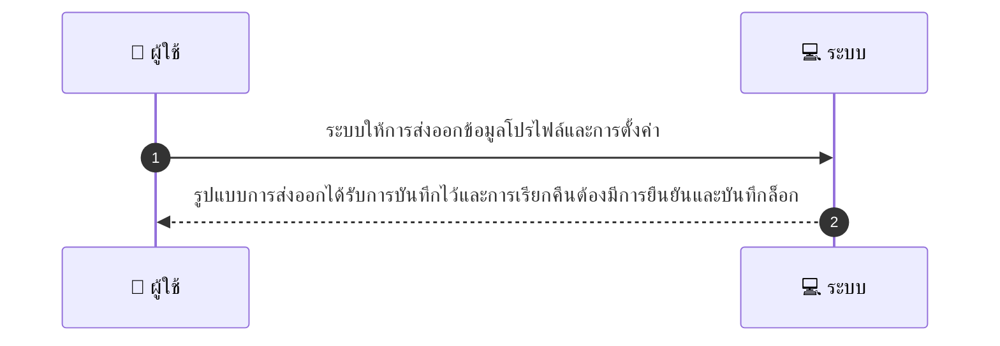
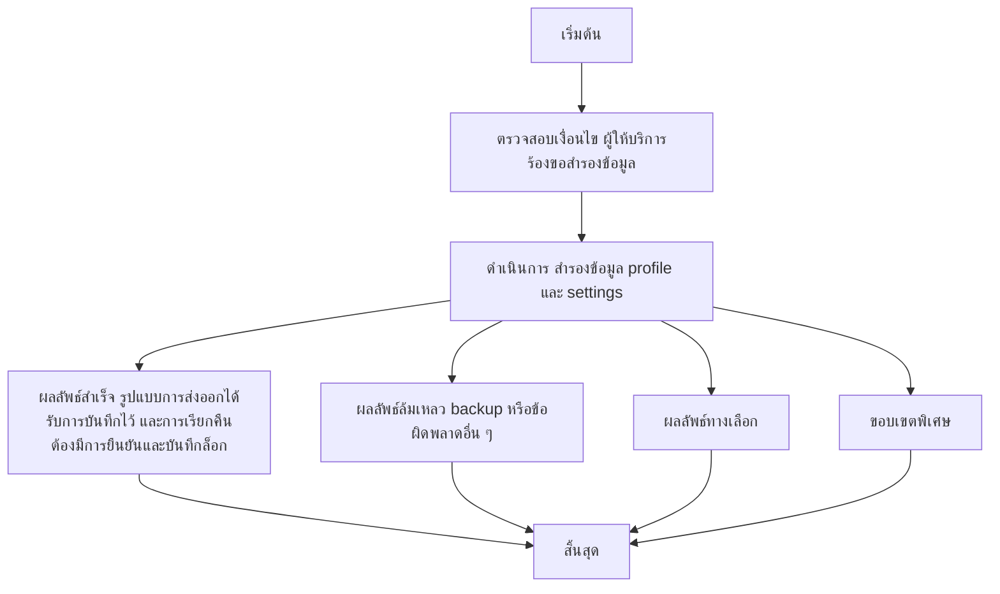

# MCC079 - ตั้งระบบ backup/restore รายการ profile และ settings

## 👤 บทบาท
- ผู้ให้บริการ

## 🎯 เป้าหมายของเคส
- ในฐานะ ผู้ให้บริการ
- ต้องการ สำรองข้อมูล profile/settings และเรียกคืนเมื่อจำเป็น
- เพื่อ ป้องกันความเสียหายจากการตั้งค่าผิดพลาด

## ⚙️ เงื่อนไขก่อนเริ่ม (Precondition)
- ผู้ให้บริการร้องขอสำรองข้อมูล

## 🧭 ผลลัพธ์และสถานการณ์
- ✅ ผลลัพธ์ที่คาดหวัง (Success Flow): รูปแบบการส่งออกได้รับการบันทึกไว้และการเรียกคืนต้องมีการยืนยันและบันทึกล็อก
- ❌ ผลลัพธ์ที่ Failure:  
  - Backup สำเร็จไม่ได้เนื่องจากสิทธิ์ของผู้ใช้งานไม่เพียงพอหรือRole ไม่อนุญาตให้เข้าถึงข้อมูลโปรไฟล์/การตั้งค่า  
  - Export ไฟล์ backup เกิดความเสียหายหรือไม่สมบูรณ์ ทำให้ไม่สามารถเรียกคืนได้  
  - เครือข่ายล่มระหว่างการส่งไฟล์ backup ไปยังที่เก็บข้อมูลสำรอง  
  - Restore ล้มเหลวเนื่องจากเวอร์ชันของ profile/settings ไม่รองรับหรือข้อมูลขัดแย้งกัน  
  - ล็อกกิจกรรมหรือล็อกไฟล์ไม่สามารถบันทึกหรือเข้าถึงได้
- 🔄 ผลลัพธ์ทางเลือก: - ไม่มีทางเลือกเพิ่มเติมในขณะนี้
- ⚠️ ผลลัพธ์ขอบเขตพิเศษ: - ไม่มีข้อยกเว้นเพิ่มเติม

## ✅ เกณฑ์การยอมรับ (Acceptance Criteria)
- ต้องมีการระบุรูปแบบการส่งออกไว้และการยืนยันการเรียกคืนพร้อมบันทึกล็อก

## ⏱ ลำดับความสำคัญ / SLA
- Priority: P2
- SLA: ส่งออกทันที restoration อาจต้องทำด้วยมือ

---

## 🔁 Sequence Diagram  
> แสดงลำดับเหตุการณ์ระหว่าง "ผู้ใช้" กับ "ระบบ"

---

## 🧭 Flowchart Diagram
> แสดงขั้นตอนการทำงานของระบบอย่างเข้าใจง่าย

