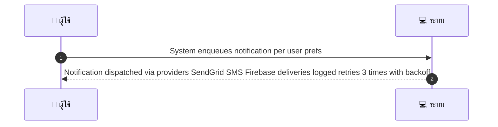
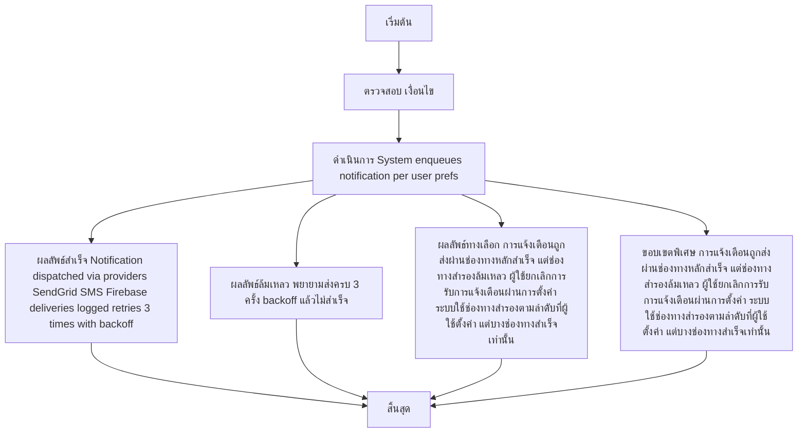

# SYS005 - Notifications Booking Confirm/Reminder/Change

## 👤 บทบาท
- ระบบ

## 🎯 เป้าหมายของเคส
- ในฐานะ
- ต้องการ
- เพื่อ

- ในฐานะ: ระบบ
- ต้องการ: ส่ง notifications email SMS push สำหรับ events confirm reminder change voucher expiry
- เพื่อ: แจ้งผู้ใช้ให้ทราบเหตุการณ์สำคัญ

## ⚙️ เงื่อนไขก่อนเริ่ม (Precondition)
- Event triggered e.g., booking confirmed

## 🧭 ผลลัพธ์และสถานการณ์
- ✅ ผลลัพธ์ที่คาดหวัง (Success Flow): Notification dispatched via providers SendGrid SMS Firebase deliveries logged retries 3 times with backoff
- ❌ ผลลัพธ์ที่ Failure:  
  - พยายามส่งการแจ้งเตือนครบ 3 ครั้งด้วย backoff แล้วไม่สำเร็จ
  - ข้อความแจ้งเตือนถูกปฏิเสธโดยผู้รับ bounce blocked หรือที่อยู่อีเมล/เบอร์โทรไม่ถูกต้อง
  - ข้อผิดพลาดในการเรนเดอร์เทมเพลต TH EN ทำให้ข้อความถูกสร้างไม่สมบูณ์
- 🔄 ผลลัพธ์ทางเลือก:  
  - การแจ้งเตือนถูกส่งผ่านช่องทางหลักสำเร็จ แต่ช่องทางสำรองล้มเหลว
  - ผู้ใช้ยกเลิกการรับการแจ้งเตือนผ่านการตั้งค่า ทำให้ไม่ส่งถึงผู้ใช้งาน
  - ระบบใช้ช่องทางสำรองตามลำดับที่ผู้ใช้ตั้งค่า แต่บางช่องทางสำเร็จเท่านั้น
- ⚠️ ผลลัพธ์ขอบเขตพิเศษ:  
  - การแจ้งเตือนถูกส่งผ่านช่องทางหลักสำเร็จ แต่ช่องทางสำรองล้มเหลว
  - ผู้ใช้ยกเลิกการรับการแจ้งเตือนผ่านการตั้งค่า ทำให้ไม่ส่งถึงผู้ใช้งาน
  - ระบบใช้ช่องทางสำรองตามลำดับที่ผู้ใช้ตั้งค่า แต่บางช่องทางสำเร็จเท่านั้น

## ✅ เกณฑ์การยอมรับ (Acceptance Criteria)
- Templates localized TH EN
- retry policy implemented
- delivery logs visible in admin

## ⏱ ลำดับความสำคัญ / SLA
- Priority: P1
- SLA: Retry up to 3 attempts

---

## 🔁 Sequence Diagram  
> แสดงลำดับเหตุการณ์ระหว่าง "ผู้ใช้" กับ "ระบบ"

---

## 🧭 Flowchart Diagram
> แสดงขั้นตอนการทำงานของระบบอย่างเข้าใจง่าย

