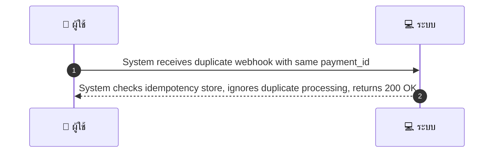
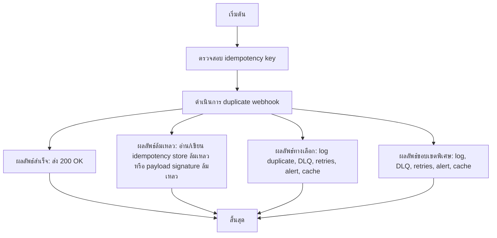

# SYS006 - Webhook replay / Idempotency tests

## 👤 บทบาท
- ระบบ

## 🎯 เป้าหมายของเคส
- ในฐานะ: ระบบ
- ต้องการ: รองรับ webhook replay และ duplicate events จาก Xendit โดยไม่ทำให้ข้อมูล inconsistent
- เพื่อ: เพื่อให้ระบบทนทานต่อการส่งซ้ำ

## ⚙️ เงื่อนไขก่อนเริ่ม (Precondition)
- Xendit re-sends webhook due to network issue

## 🧭 ผลลัพธ์และสถานการณ์
- ✅ ผลลัพธ์ที่คาดหวัง (Success Flow): System checks idempotency store, ignores duplicate processing, returns 200 OK  
- ❌ ผลลัพธ์ที่ Failure:  
  - HTTP 500/502/503 ในกรณีอ่าน/เขียน idempotency store ล้มเหลว
  - ล้มเหลวในการตรวจสอบ payload หรือ signature ของ webhook ส่งผลให้ไม่สามารถยืนยันซ้ำซ้อนได้
  - ระบบประมวลผลล้มเหลวจากปัญหาเครือข่าย/ฐานข้อมูล ทำให้ไม่สามารถบันทึกสถานะ idempotency ได้
- 🔄 ผลลัพธ์ทางเลือก:  
  - คืน HTTP 200 OK ทันที พร้อมบันทึก duplicate event ลง log เพื่อการตรวจสอบภายหลัง
  - ส่ง duplicate webhook ไปยัง Dead Letter Queue DLQ เพื่อวิเคราะห์ภายหลัง
  - ทำ retries ตาม policy ที่กำหนด โดยไม่ทำซ้ำการอัปเดตข้อมูลเดิม idempotent fast-path
  - ส่ง alert ไปยังทีม SRE/DevOps เมื่อพบ duplicate webhook
  - เก็บข้อมูลอ้างอิงซ้ำไว้ใน cache เพื่อเร่งการตรวจสอบในรอบถัดไป
- ⚠️ ผลลัพธ์ขอบเขตพิเศษ:  
  - คืน HTTP 200 OK ทันที พร้อมบันทึก duplicate event ลง log เพื่อการตรวจสอบภายหลัง
  - ส่ง duplicate webhook ไปยัง Dead Letter Queue DLQ เพื่อวิเคราะห์ภายหลัง
  - ทำ retries ตาม policy ที่กำหนด โดยไม่ทำซ้ำการอัปเดตข้อมูลเดิม idempotent fast-path
  - ส่ง alert ไปยังทีม SRE/DevOps เมื่อพบ duplicate webhook
  - เก็บข้อมูลอ้างอิงซ้ำไว้ใน cache เพื่อเร่งการตรวจสอบในรอบถัดไป

## ✅ เกณฑ์การยอมรับ (Acceptance Criteria)
- Webhook handler checks idempotency keys
- keys retained configurable period e g 7 days
- duplicate webhooks safe

## ⏱ ลำดับความสำคัญ / SLA
- Priority: P1
- SLA: Idempotency keys retention 7d

---

## 🔁 Sequence Diagram  
> แสดงลำดับเหตุการณ์ระหว่าง "ผู้ใช้" กับ "ระบบ"

---

## 🧭 Flowchart Diagram
> แสดงขั้นตอนการทำงานของระบบอย่างเข้าใจง่าย

